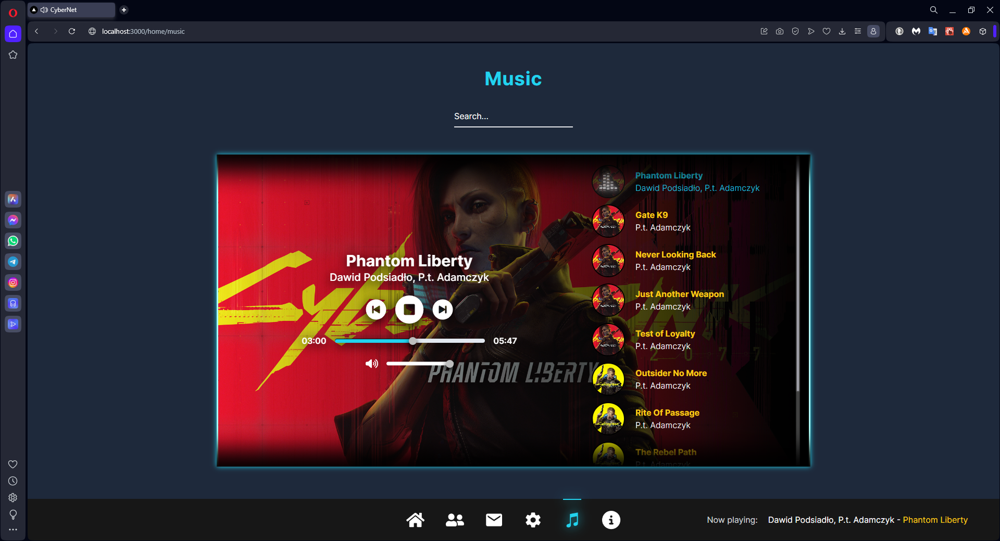

# CYBERNET

**"CyberNet"** is a custom web social app developed with Next.js and Auth.js in "*Cyberpunk 2077*" style.

---

## Tech Stack

**Primary:**

- Next.js (app router, 14.0.4);
- Auth.js (^5.0.0-beta.4);
- React library;
- Postgresql (DB located on website "Supabase");
- ORM Prisma;
- nodemailer;
- auth/prisma-adapter;
- bcryptjs;
- uuid;

**Secondary:**

- zod;
- sass;
- tailwind;
- react-icons;
- react-spinners;
- react-transition-group;
- react-toastify;
- next-ui.

---

## Technical Explanation

### Sign in / Sign up functionality

**Sign in** and **Sign up** forms are located in component *`AuthForm.tsx`*. To implement logging and registration we will use server actions, which are provided by Next.js. To manage states of forms with server actions we will use react-dom hook '*useFormState*'. Server actions are situated in folder `actions` in files called `login.ts` and `sign-up.ts`.

Validating form fields will be in server actions using **ZOD**. All zod schemas are located in folder `schemas`.

**Sign up logic**:

- *Name*, *Username* and *Email* must be unique, *Passsword*;
- Check if user already exist;
- Create user in database;
- Send verification token to email (expires in 1 hour);
- *If any error occurs -> send error obj to client component;*

**Sign in logic:**

- Enter *Username* or *Email*;
- Check if user exists;
- Check if user confirms his email -> else simply user will not be able to login;
  - send verification token again (expires in 1 hour);
- Call function "**signIn()**" which is a part of Auth.js and passing arguments;

```typescript
  const result = SignInSchema.safeParse({
    signin: formData.get('signin'),
    password: formData.get('password'),
  });

  await signIn('credentials', {
    signin: result.data.signin,
    password: result.data.password,
  });
```

- Execute function authorize() which is located in ```auth.config.ts``` (read more about *[Edge compatability](<Edge compatability (Auth.js).md>)* in Auth.js) -> returns user;
- After that Auth.js callbacks are executed in file `auth.ts`:
  - Firstly, "**jwt()**" which receives, modify and returns token to session;
  - Secondary, "**session()**" which receives token, modify session with token-data and returns session;
- And finally -> executing auth() from `middleware.ts`;

---

### Verification functionality

Verification token will be created after register in separate table `VerificationToken` during registration.

```js
const verificationToken = await generateVerificationToken(
  result.data.email
);

await sendVerificationEmail(
  verificationToken.email,
  verificationToken.token
);
```

If user doesn't verify email, the another one will be sent and new verification token will be generated.
Token will be created in file `lib/tokens.ts` by function *`generateVerificationToken(email: string)`* using `uuid` library.

```ts
export async function generateVerificationToken(email: string) {
  const token = uuidv4();
  const expires = new Date(new Date().getTime() + 3600 * 1000); //expire token in 1 hour

  /**
   * Check if we already sent token to email
   */
  const existingToken = await getVerificationTokenByEmail(email);
  if (existingToken) {
    await db.verificationToken.delete({
      where: {
        id: existingToken.id,
      },
    });
  }

  const verificationToken = await db.verificationToken.create({
    data: {
      email,
      token,
      expires,
    },
  });

  return verificationToken;
}
```

Sending verification emails is implemented using Nodemailer in file `lib/mail.ts`.
After clicking on verifying email from user's native mail -> redirect to page `/auth/new-verification`, where automatically will be triggered server action `verificationToken` from file `actions/new-verification`.
In this server action we will get token from DB using token we sent to user (in verification email). After cheking we add new Date to User DB in field emailVerified.

And one more important thing, that we will update email. The reason is whenever the user wants to change email in settings, we won't immediately update his email in our DB. Instead, we will send new verification email with token to that email, and update after verification.

```ts
/* 
  update date in user DB from null to date of verification; 
  also update email (in case user will change email in future) 
*/
await db.user.update({
  where: { id: existingUser.id },
  data: {
    emailVerified: new Date(),
    email: existingToken.email,
  },
});

await db.verificationToken.delete({
  where: { id: existingToken.id },
});
```

---

### Friend List Functionality

By default, user has additional two columns, which represent his relations with another users. Check out Prisma schema below. `prisma/schema.prisma`:

```prisma
  model User {
    id             String    @id @default(cuid())
    name           String
    username       String    @unique
    email          String    @unique
    password       String
    emailVerified  DateTime?
    image          String?
    friends        User[]    @relation("friends")
    friendsAddedMe User[]    @relation("friends")
  }
```

According to schema, we are using an explicit many-to-many (*`m-n`*) relations between the `User` entity and itself through the `friends` and `friendsAddedMe`:

- `friends` represents who user added to his friend list;
- `friendsAddedMe` represents who added user to their friend list;

So, to be more precise, let's imagine two users: *Johnny* and *Panam*.

- If *Johnny* has *Panam* in `friends`, BUT DOES NOT have in `friendsAddedMe` -> means *Johnny* sent friend request to *Panam*.
- If *Johnny* has *Panam* in `friendsAddedMe`, BUT DOES NOT have in `friends` -> means *Panam* sent friend request to *Johnny*.
- If *Johnny* has *Panam* in `friends`, AND has in `friendsAddedMe` -> means *Panam* and *Johnny* are friends. (Same must be for *Panam*.)


---

### MP3 Player Functionality

Information about `<audio />` and song we are going to store in RTK.

```TypeScript
interface SongSlice {
  song: Music | null;
  volume: number;
  isPlaying: boolean;
  totalDuration: number;
  currentTime: number;
  moveTo: false | number;
  playlistLength: number | null;
}

const initialState: SongSlice = {
  song: null,
  volume: 0.5,
  isPlaying: true,
  totalDuration: 0,
  currentTime: 0,
  moveTo: false,
  playlistLength: null,
};
```

To play songs anywhere in the app, `<audio />` will be rendered in `NavBar.tsx - (client component that is visible on any page (except login page))`.

```jsx
<audio
  onEnded={handleSongEnded}
  onTimeUpdate={(e) =>
    dispatch(
      songSliceActions.setCurrentTime(e.currentTarget.currentTime)
    )
  }
  onDurationChange={(e) =>
    dispatch(
      songSliceActions.setSongDuration(e.currentTarget.duration)
    )
  }
  ref={songRef}
  src={song.songUrl}
/>
```

- `onTimeUpdate` is responsible for updating current time of the song in RTK (songSlice).
- `onDurationChange` is responsible for getting song total duration and dispatching in RTK (songSlice).

Using these event handlers (`onTimeUpdate` and `onDurationChange`) we are going to move our seeker and change time in MP3-player.

- `onEnded` is responsible for fetching new song from DB using current song id.

MP3-player by itself is located on Music Page.



Playlist does not have huge size, so we will get full `playlist.length` after opening Music page. Song id in DB has type Int (Number) with autoincrement '+1'. So after end of the song we will fetch `current song.id + 1`. If `song.id === playlist.length` => fetch song with id '**1**'.
